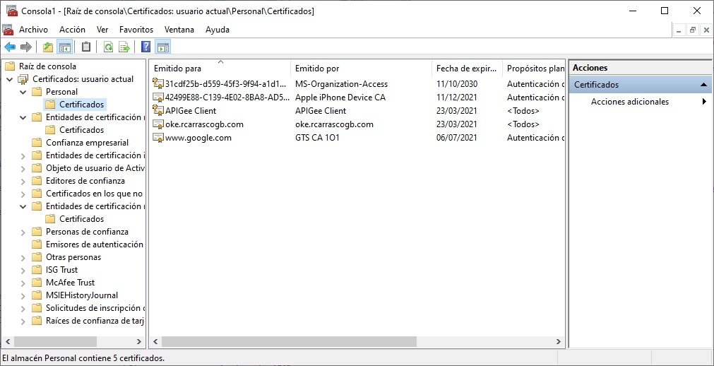

# Java Windows Certificate Store Integration.

The java class com.sps.Tester shows how to use Windows Certificate Store within a Java Class in order to consume a Service using HTTPs.

With this, the java class will use Windows Certificate Store as its truststore, which can be useful because with this the certificates can be managed
by a PKI and:

- Manage the lifecycle of a certificate
- Revoke them
- Update them
- etc

This, instead of use a java keystore (jks) where we will have to manage it in order to make the previous listed actions. 

In this repository you will find the class com.sps.Tester, which basically loads Windows-Root keystore, and then calls https://www.google.com. 

In line 30 and 31 (com.sps.Tester) we are loading Windows Certificate Store:

```
        KeyStore ks = KeyStore.getInstance("WINDOWS-MY");
        ks.load(null, null);
```

There are two options you can use to load Windows Certificate Store:
- WINDOWS-ROOT: this one all the CA certificates
- WINDOWS-MY: this loads your trusted certificates.

In this test case scenario, we are using both of them and you can switch in the code.

In order to manage your certificates you can do it via MMC. 



You can build and package the class using maven, and then just execute:


```java -jar Tester-1.0-SNAPSHOT.jar```

And you will see an output like this:

```
---> alias : Go Daddy Root Certificate Authority ? G
---> alias : Sectigo (formerly Comodo CA)
---> alias : DigiCert (2)
---> alias : DigiCert Baltimore Root
---> alias : ISRG Root X1
---> alias : Sectigo (AddTrust)
---> alias : T-TeleSec GlobalRoot Class 2
---> alias : Certum Trusted Network CA
---> alias : Microsoft Authenticode(tm) Root
---> alias : GlobalSign Root CA - R3
---> alias : GlobalSign Root CA - R1
---> alias : GeoTrust Global CA
---> alias : Google Trust Services - GlobalSign Root CA-R2
---> alias : SECOM Trust Systems CO LTD
---> alias : VeriSign Class 3 Public Primary CA
---> alias : VeriSign Time Stamping CA
---> alias : GeoTrust
---> alias : GlobalSign ECC Root CA - R5
---> alias : Amazon Services Root Certificate Authority -- G2
---> alias : QuoVadis Root Certification Authority
---> alias : SECOM Trust Systems Co Ltd.
---> alias : Entrust (2048)
---> alias : QuoVadis Root CA 2
---> alias : Entrust.net
---> alias : Symantec Enterprise Mobile Root for Microsoft
---> alias : GTS Root R1
---> alias : Microsoft Root Certificate Authority
---> alias : Microsoft ECC Product Root Certificate Authority 2018
---> alias : Microsoft Time Stamp Root Certificate Authority 2014
---> alias : Go Daddy Class 2 Certification Authority
---> alias : thawte
---> alias : Certum
---> alias : QuoVadis Root CA 2 G3
---> alias : Sectigo (AAA)
---> alias : DST Root CA X3
---> alias : SwissSign Silver G2 Root CA
---> alias : StartCom Certification Authority
---> alias : Sectigo (UTN Object)
---> alias : VeriSign
---> alias : Microsoft ECC TS Root Certificate Authority 2018
---> alias : Starfield Class 2 Certification Authority
---> alias : Thawte Timestamping CA
---> alias : AffirmTrust Commercial
---> alias : Actalis Authentication Root CA
---> alias : SSL.com Root Certification Authority RSA
---> alias : DigiCert
---> alias : Microsoft Root Certificate Authority 2011
---> alias : Sectigo
---> alias : Hotspot 2.0 Trust Root CA - 03
---> alias : Microsoft Timestamp Root
---> alias : Sectigo ECC
---> alias : DigiCert Global Root G2
---> alias : Microsoft Root Authority
---> alias : DigiCert (1)
---> alias : Entrust
---> alias : Trustwave
---> alias : VeriSign Universal Root Certification Authority
---> alias : Microsoft Root Certificate Authority 2010
---> alias : Starfield Root Certificate Authority ? G
Mensaje de respuesta: OK. HTTP Response Code: 200
Content-Type: text/html; charset="utf-8"
```

It will print all the alias that the keystore includes, and then the response code from making a GET to https://www.google.com


